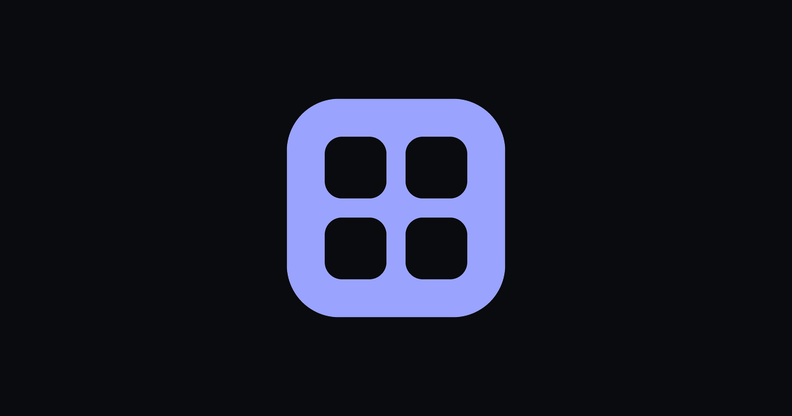

<p align="center">
  
</p>

<h1 align="center">geekgallery</h1>

<p align="center">
  A community gallery for one running joke — pictures, GIFs and clips, free uploads, no account needed — that becomes <i>your</i> site through configuration alone. One build, any number of galleries.
</p>

<p align="center">
  
  
  
  
</p>

---

## What it is

Every good running joke eventually needs a home: the place where all the
variants get collected, named, searched, and linked to from group chats. Most
of those homes are a Discord channel or a folder on somebody's phone.
geekgallery is the missing piece — a small, fast, self-hosted gallery that
takes a picture, a GIF or a clip (or a link to one), gives it a page with a
link that unfurls properly everywhere, an embed code, a spot in the grid, and
a place in search.

The name is the point: it is a gallery for geeks — people who care about one
joke enough to catalogue it.

What makes it different from forking a template is that **nothing about a site
is in the code**. The name, what one entry is called, the colours, the logo,
what the like button says and draws, the domain, the legal contact, the sister
sites in the footer — all of it is a **flavor**: one `KEY=VALUE` file, held as
one secret, read at startup. Run two galleries, or twenty, from the same image.
**[FLAVORS.md](FLAVORS.md) lists every key.**

Every item is one of three things:

- an **image** (PNG, JPG, WEBP, up to 12 MB), re-encoded on the way in;
- a **GIF** (up to 12 MB), stored exactly as uploaded so it keeps animating;
- a **clip** (MP4 or WEBM, up to 60 MB), stored as uploaded and played inline.

## Features

- **The gallery** — infinite scroll, four densities, newest / most-liked / A–Z /
  clips-only orderings and an "item of the day".
- **Uploads** with duplicate refusal and a cover-frame picker for clips, plus a
  paste-a-link importer for X, YouTube, TikTok, Reddit, Instagram, Facebook,
  Vimeo, Twitch, Threads, Bluesky, any page with Open Graph tags and any bare
  media URL. Every fetch goes through one guarded client that refuses
  non-public addresses.
- **Accounts, optional** — Google sign-in, a leaderboard, likes, reports, a
  three-report auto-hide and an admin queue; pseudonyms for people who
  contribute but would rather not be named.
- **A captcha** (Cloudflare Turnstile) in front of uploads and imports.
- **A mirror** — optionally pull another gallery's sitemap into this one, hourly.
- **Search-engine ready** — sitemap with the Images and Video extensions,
  `ImageObject`/`VideoObject`/`BreadcrumbList`/`WebSite` JSON-LD, Open Graph,
  Twitter cards, oEmbed, `llms.txt`, IndexNow pings, a framable `/embed/:slug`
  card and a documented JSON API (`/api/v1/items`).
- **Provenance** in every stored still (PNG iTXt / JPEG COM, and an invisible
  LSB watermark in PNGs) naming the site and the page it came from.
- **Themes** — sixteen colour tokens as CSS variables; set one accent and the
  hover, pressed and muted variants are derived.

## Moderation

Nothing is screened before it appears and nothing waits for approval: an upload
is live the moment it is stored. Anyone signed in can report an item; three
reports hide it automatically, and every report lands in `/admin` for a human,
who can hide or delete anything. That is the mechanism, not a fallback for one.

## Privacy

Uploads are shown without public attribution (first name only if you sign in),
but this does **not** mean complete technical anonymity: a site running this
software and its infrastructure process IP addresses, timestamps and request
logs for security and abuse prevention. Images are re-encoded, which strips
camera metadata; GIFs and videos are stored as uploaded, so strip your own if
it matters.

## Rights and licensing

The license covering this repository's **source code** does not apply to
user-uploaded media on any site running it. By uploading to such a site, you
confirm you have the right to share it and you grant that site permission to
store, display, process, moderate and distribute it as part of the site, its
API and its embeds.

---

## Running it

Pure Rust, including the UI: [Leptos](https://leptos.dev) 0.8 (SSR +
hydration) on Axum, Tailwind for styling, Cloudflare D1 for data and R2 for
media. The app is one binary; the production image is that binary plus
`cloudflared` and the importer's tools (`yt-dlp`, `deno`, `ffmpeg`) as pinned
static binaries.

**The flavor is read once, on both sides.** `main` installs it from the
environment; the server writes it into every page as `<script id="gg-flavor">`
and the wasm reads it back before hydrating, so both sides render the same
words (see `src/flavor.rs`, and `CLAUDE.md` for the traps).

**No local database.** Development talks to a real D1 database — there is no
SQLite fallback to drift from. Uploads go to `./uploads` on disk when no R2
bucket is configured.

**Video is never decoded on the server for uploads.** The browser draws a
frame of a picked clip onto a canvas and uploads it as the poster. ffmpeg is in
the image only for the link importer, which has no browser in the loop.

### Locally

```bash
cp .env.example .env          # fill in the Cloudflare values; everything else
                              # has a default (see FLAVORS.md)
npm install                   # Tailwind only; the image builds without Node
cargo install cargo-leptos --locked
cargo leptos watch            # http://127.0.0.1:3100
```

`watch`, not `serve` — `serve` doesn't watch anything.

### The gate, before you push

```bash
cargo fmt --all -- --check
cargo clippy --no-default-features --features ssr --all-targets -- -D warnings
cargo clippy --no-default-features --features hydrate --target wasm32-unknown-unknown -- -D warnings
cargo test  --no-default-features --features ssr
scripts/audit-secrets.sh      # no credential in history, files or build output
```

Both feature sets, always: `ssr` and `hydrate` compile disjoint code from the
same files, so one passing tells you nothing about the other. `git config
core.hooksPath .githooks` runs all of it on every push.

### A new site, from nothing

```bash
CF_ZONE=example.com FLAVOR=example scripts/cloudflare-provision.sh > example.env
scripts/d1-migrate.sh example                   # the schema
CF_ZONE=example.com scripts/cloudflare-setup.sh --apply
cargo run --example brand_art --features ssr -- --accent '#hex' --bg '#hex' --out art/
# add SITE_*/THEME_*/SITE_LIKE_* and DEPLOY_HOST/DEPLOY_HOST_KEY/TS_CI_AUTHKEY to example.env
cd deploy/env-broker && npx wrangler secret put FLAVOR_ENV_EXAMPLE < example.env
```

Then push. [FLAVORS.md](FLAVORS.md) has the whole procedure and every key;
`deploy/env-broker/README.md` covers the broker.

### Deploying

One image for every flavor: the site and `cloudflared` under supervisor
(`Dockerfile`, `deploy/supervisord.conf`, `docker-compose.yml`). A push to
`main` builds it once, pushes it to GHCR by digest, asks the deploy-env broker
which flavors exist, and runs one deploy job per flavor: each joins the
tailnet as an ephemeral `tag:ci` node with that flavor's key, ships the
compose file and the flavor's blob to `/opt/geekgallery/<flavor>/` on its
host over Tailscale SSH, and waits for the container to report healthy,
rolling back to the previous image if it never does. Adding a site is adding
a secret.

No credential is a build argument, none is in an image layer, and there is no
`.env` on the server. `scripts/audit-secrets.sh` keeps that a fact: it scans
git history, tracked files, the binary, the wasm, and (with `--image`) every
layer of the built image.

## Contributing

See [CONTRIBUTING.md](CONTRIBUTING.md). Read `CLAUDE.md` first — it is the
list of things that have already cost real time in this codebase, and it is
not documentation of how the code works; it is a list of traps. This project
follows the [Contributor Covenant](CODE_OF_CONDUCT.md).

## Security

See [SECURITY.md](SECURITY.md).
